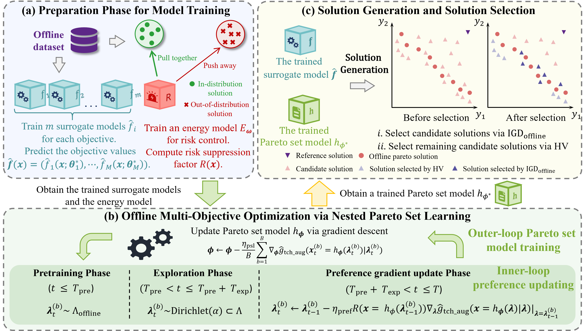

<div align="center">

### Diversity-Driven Offline Multi-Objective Optimization via Nested Pareto Set Learning

[](https://icml.cc/)
[](https://www.python.org/)
[](https://pytorch.org/)

Official implementation of **DOMOO**, accepted by **ICML 2026**.

</div>

<div style="text-align: center;">
  
</div>

## 🖼️ Framework

The DOMOO framework contains three main stages:

- **(a) Surrogate & Risk Modeling:** Train per-objective surrogate models on the offline dataset, and energy-based models for OOD risk quantification.
- **(b) Nested Pareto Set Learning (NPSL) with Risk Control:** Jointly optimize the Pareto set model and preference vectors in a nested manner. The inner loop updates preferences via risk-modulated gradient descent, exploring underrepresented regions while suppressing OOD-prone steps. The outer loop trains the Pareto set model under these risk-guided preferences.
- **(c) Diversity-Driven Solution Selection:** Generate candidate solutions from both the Pareto set model and surrogate model, then select a diverse and well-converged subset using the IGD_off and HV indicators.

## 📖 Introduction
Multi-objective optimization (MOO) is widely used in fields ranging from neural architecture search to antenna design, where practitioners must balance conflicting goals. In many practical scenarios, evaluating true objective functions can be prohibitively expensive or hazardous, necessitating optimization solely based on a fixed offline dataset. This offline MOO setting suffers from the out-of-distribution (OOD) issue, where surrogate models produce unreliable predictions for unseen designs.

Due to the OOD issue, surrogate errors may cause the optimizer to select solutions that do not lie on the true Pareto front and are biased toward its extremes, leading to a severely imbalanced Pareto front with degraded diversity and convergence.

To address this, we propose Diversity-Driven Offline Multi-Objective Optimization (DOMOO), a Nested Pareto Set Learning (NPSL) framework designed to find diverse and high-quality solutions. DOMOO incorporates an accumulative risk control module that estimates the potential risk of candidate solutions and alleviates the OOD issue between the training data and the generated solutions. In addition, a nested PSL strategy jointly learns preference-conditioned mappings and optimizes preference vectors under accumulative risk control, enabling adaptation to diverse Pareto front geometries. To further enhance solution quality, we design a diversity-driven selection strategy with a novel $\text{IGD}_\text{offline}$ indicator tailored for the offline setting, which balances diversity and convergence while avoiding the bias of the hypervolume indicator. Extensive experiments on synthetic and real-world benchmarks show that DOMOO achieves the best average rank across tasks over comparable offline MOO methods.

## 📦 Setup Environment

DOMOO requires two versions of Off-MOO-Bench:
- **Official version** ([lamda-bbo/offline-moo](https://github.com/lamda-bbo/offline-moo)): for running baseline algorithms.
- **ParetoFlow version** ([mila-iqia/ParetoFlow](https://github.com/mila-iqia/ParetoFlow/tree/main/experiments/offline_moo)): for running DOMOO (modified experiment infrastructure).
- Both versions have a normalization bug that must be patched.

1. Clone this repository:
```bash
git clone https://github.com/your-org/DOMOO.git
cd DOMOO
```

2. Install the official Off-MOO-Bench (for baselines):
```bash
mkdir baseline && cd baseline
git clone https://github.com/lamda-bbo/offline-moo.git
cd offline-moo && bash ./install.sh
cd ../..
```

3. Install the ParetoFlow version (for DOMOO):
```bash
git clone https://github.com/mila-iqia/ParetoFlow.git
ln -s ParetoFlow/experiments/offline_moo ./DOMOO/offline_moo
# Copy data from official version
cp -r ./baseline/offline-moo/data ./DOMOO/offline_moo
cp -r ./baseline/offline-moo/off_moo_bench/problem/mo_nas/data ./DOMOO/offline_moo/off_moo_bench/problem/mo_nas
cp -r ./baseline/offline-moo/off_moo_bench/problem/mo_nas/database ./DOMOO/offline_moo/off_moo_bench/problem/mo_nas
```

4. (Optional) Prepare the RFP proxy model:
```bash
conda activate off-moo
cd ./DOMOO/offline_moo/off_moo_bench/problem/lambo
python scripts/black_box_opt.py optimizer=mf_genetic optimizer/algorithm=nsga2 task=proxy_rfp tokenizer=protein
cd ../../../..
```

5. Fix normalization bugs (both versions affected) and add IGD_off to baselines:
```bash
# Fix normalization in official Off-MOO-Bench
cp ./replace/dataset_builder_original.py ./baseline/offline-moo/off_moo_bench/datasets/dataset_builder.py
# Fix normalization in ParetoFlow version
cp ./replace/dataset_builder_paretoflow.py ./DOMOO/offline_moo/off_moo_bench/datasets/dataset_builder.py
# Add IGD_off evaluation to baseline methods
cp ./replace/experiment_end2end.py ./baseline/offline-moo/off_moo_baselines/end2end/experiment.py
cp ./replace/experiment_mobo.py ./baseline/offline-moo/off_moo_baselines/mobo/experiment.py
cp ./replace/experiment_multi_head.py ./baseline/offline-moo/off_moo_baselines/multi_head/experiment.py
cp ./replace/experiment_multiple_models.py ./baseline/offline-moo/off_moo_baselines/multiple_models/experiment.py
```

6. Install Python dependencies:
```bash
conda create -n off-moo python=3.8
conda activate off-moo
pip install -r requirements.txt
```

7. Prepare baseline results. The method requires pre-computed solutions from MultipleModels-Vallina. Place them in a directory and pass it via `--multiple_model_results`.

## 📥 Project Structure
```
├── DOMOO/                     # DOMOO source code
│   ├── domoo.py               # Main entry point
│   ├── energy_model.py        # Energy-based risk model
│   ├── utils.py               # Utility functions (PSL training, evaluation)
│   ├── exper.py               # Argument parser & task-specific defaults
│   ├── process_result_hv.py   # HV ranking script
│   └── process_result_igdoff.py
├── scripts/                   # Shell scripts for batch experiments
│   ├── run.sh                 # Full pipeline
│   ├── domoo_main.sh          # Main experiments
│   ├── domoo_ablation1.sh     # w.o. ARC
│   ├── domoo_ablation2.sh     # w.o. NPSL
│   ├── domoo_ablation3.sh     # w.o. DDSS
│   ├── domoo_ablation4.sh     # w.o. PSMG
│   └── domoo_ablation5.sh     # w.o. SMG
├── replace/                   # Bug-fix patches for Off-MOO-Bench
├── picture/                   # Method illustration
├── baseline/                  # Official Off-MOO-Bench (for baselines)
│   └── offline-moo/           #   after setup
├── DOMOO/offline_moo →        # Symlink to ParetoFlow's modified version
│   ParetoFlow/experiments/offline_moo
├── requirements.txt
└── README.md
```

## 🏃 How to Run
```bash
cd DOMOO
bash ../scripts/domoo_main.sh          # Main experiments (5 seeds × all tasks)
bash ../scripts/domoo_ablation1.sh     # Ablation: w.o. ARC
# For a single quick test:
python domoo.py --task zdt3 --seed 1000
```

## 🚀 Quick Start

```bash
cd DOMOO
python domoo.py --task zdt3 --seed 1000
```

A more explicit run:

```bash
python domoo.py \
  --task dtlz3 \
  --seed 1000 \
  --model DOMOO \
  --train_mode Vallina \
  --results_dir ./result \
  --model_save_dir ./model \
  --energy_save_dir ./energy_model \
  --multiple_model_results ./baseline_results \
  --retrain_model False \
  --data_pruning True \
  --normalization True
```

Results are saved to `./result/DOMOO-Vallina-DTLZ3-Exact-v0/` including HV and IGD_off metrics.

## 🔧 Key Arguments

| Argument | Default | Description |
| --- | ---: | --- |
| `--task` | `zdt3` | Task short name (e.g., dtlz3, mo_hopper_v2, regex) |
| `--seed` | `1000` | Random seed |
| `--model` | `DOMOO` | Model name for directory naming |
| `--t_steps` | `200` | Exploration phase steps (random preference sampling) |
| `--n_steps` | `300` | Total PSL training steps |
| `--psmodel_pretrain_nepoch` | `200` | Pareto set model pretraining epochs |
| `--Ld_K_max` | `42` | Langevin steps for OOD boundary estimation |
| `--Ld_K` | `64` | Langevin steps for energy model training |
| `--risk_ratio` | `0.001` | Risk control strength |
| `--data_pruning` | `True` | Use top-20% non-dominated solutions for surrogate training |
| `--normalization` | `True` | Apply min-max normalization |
| `--retrain_model` | `False` | Retrain surrogate from scratch (if True) |
| `--results_dir` | `./result` | Output directory |
| `--multiple_model_results` | — | Path to cached MultipleModels-Vallina results |
| `--no_energy` | `False` | Ablation: disable risk control |
| `--no_bilevel` | `False` | Ablation: disable nested PSL |
| `--no_igdoff` | `False` | Ablation: disable IGD_off selection |
| `--no_psl` | `False` | Ablation: use surrogate only (w.o. PSMG) |
| `--no_surrogate` | `False` | Ablation: use PSL only (w.o. SMG) |

## 📚 Citation

```bibtex
@inproceedings{domoo,
  title     = {Diversity-Driven Offline Multi-Objective Optimization via Nested Pareto Set Learning},
  author    = {Yiyi Zhu, Yaolin Wen, Xiang Xia, Xin An, Hanyi Si, Xiang Shu, Yangde Fu, Liang Dou, Hong Qian},
  booktitle = {Proceedings of the 43rd International Conference on Machine Learning},
  year      = {2026},
  address   = {Seoul, Korea}
}
```

## 🙏 Acknowledgements
This project builds upon valuable work from the following repositories:
- Benchmarks: [Off-MOO-Bench](https://github.com/lamda-bbo/offline-moo)
- Pareto Set Learning: [PSL-MOBO](https://github.com/Xi-L/PSL-MOBO)
- Risk Control: [ARCOO](https://github.com/luhuakang/ARCOO)

We extend our sincere thanks to the creators of these projects for their contributions to the field and for making their code available. 🙌
